# DH150 Assignment 5: Persona + Scenario by Lillian Nguyen

## UX Storytelling
In order to create better products centered around the user, it is important to understand their motives, frustrations, and needs. By doing this, we develop a successful solution to their problems and improve their experience. It helps to keep all stakeholders and team members stay focused on the problem area and work toward solving the same case. The stories are derived from prior research and then communicated through personas, empathy maps, and journey maps to empathize with the target audience and develop persuasive solutions.

## Ideation
Focus on **three research questions**:
* How might we improve the report system for better tracking?
* How might we bring locals together to contribute toward keeping San Jose clean and safe?
* How might we create an intuitive design so users can accomplish tasks quickly and effortlessly?

## Person #1 - Ben Johnson
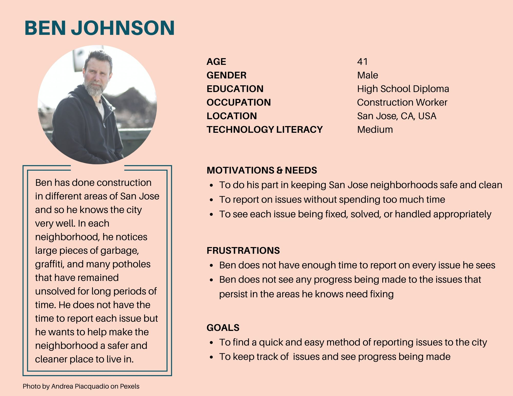 
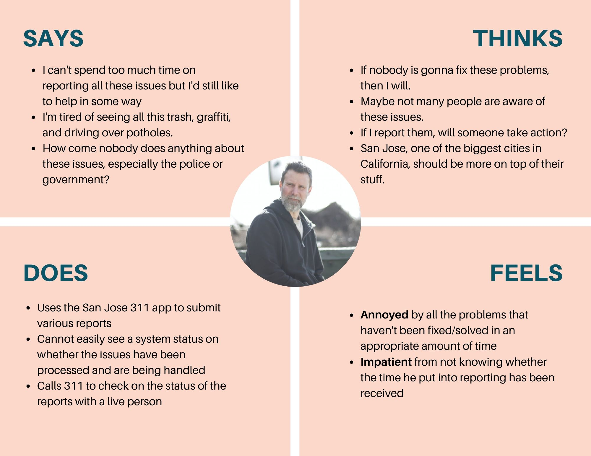
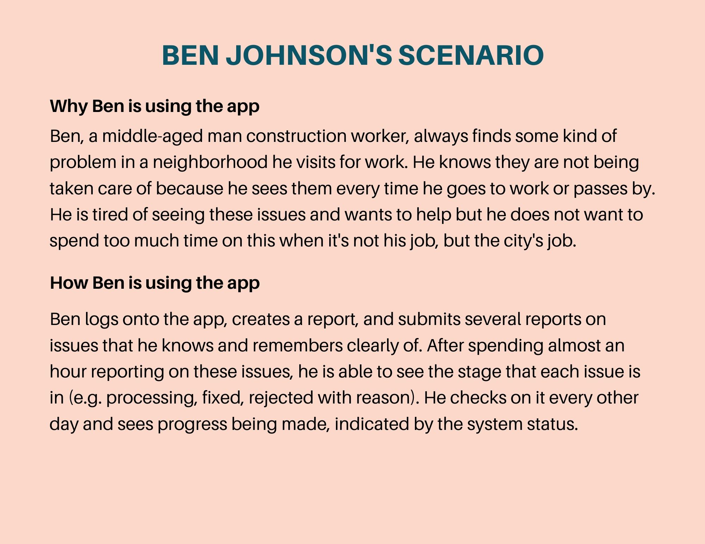 
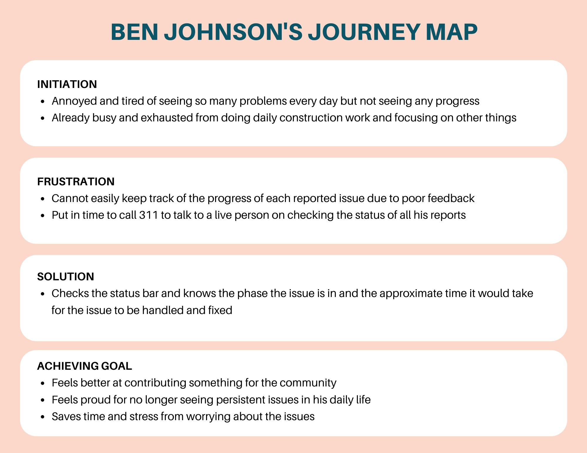 

## Person #2 - Katie Lee
 
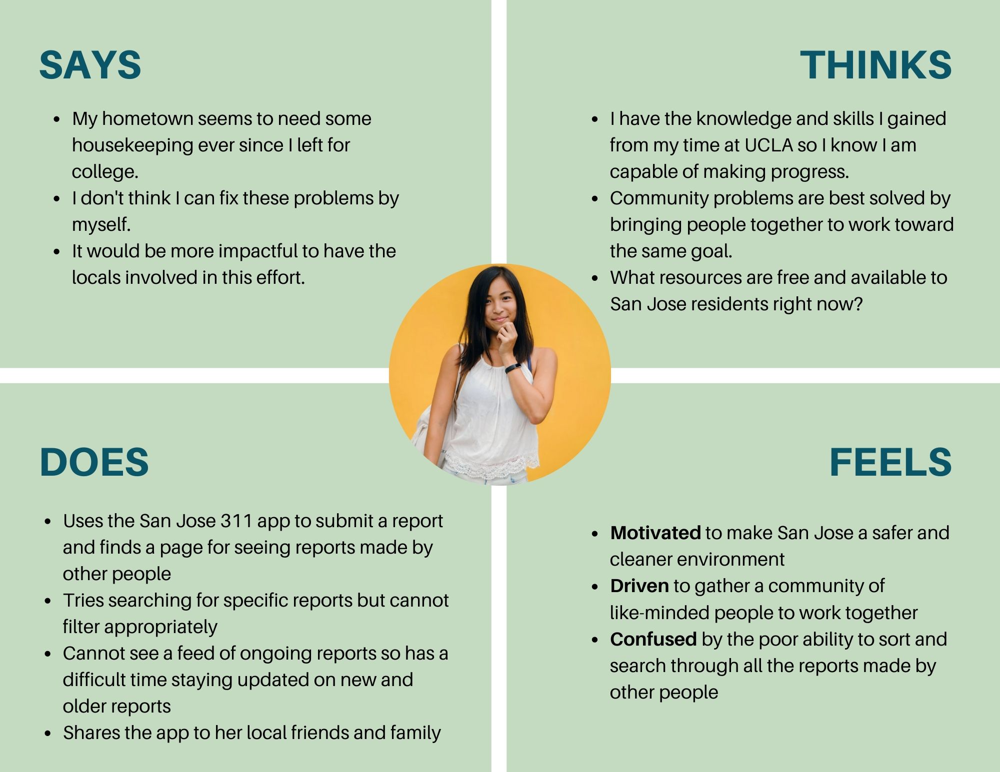
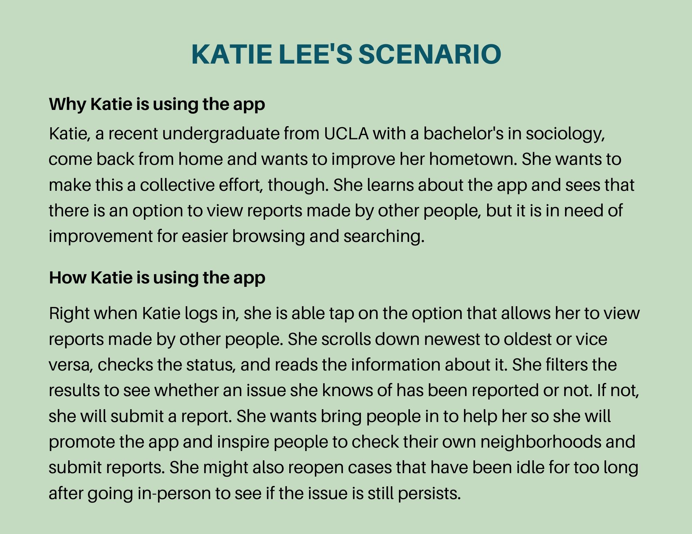 
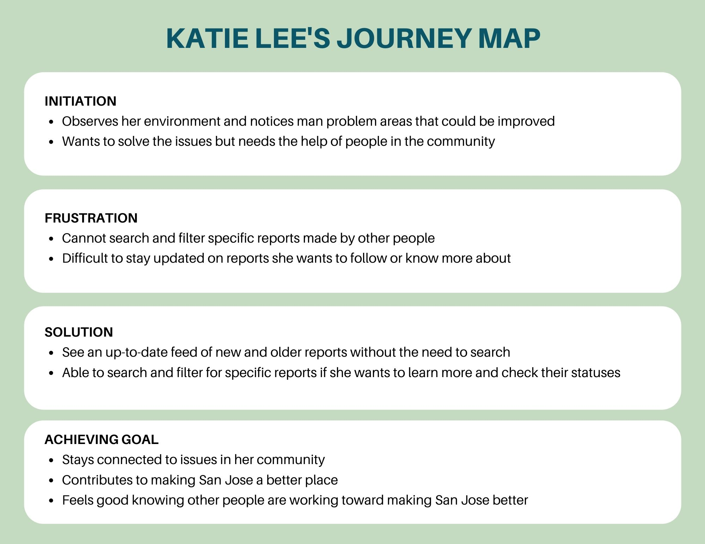 

## Person #3 - Karen Shelley
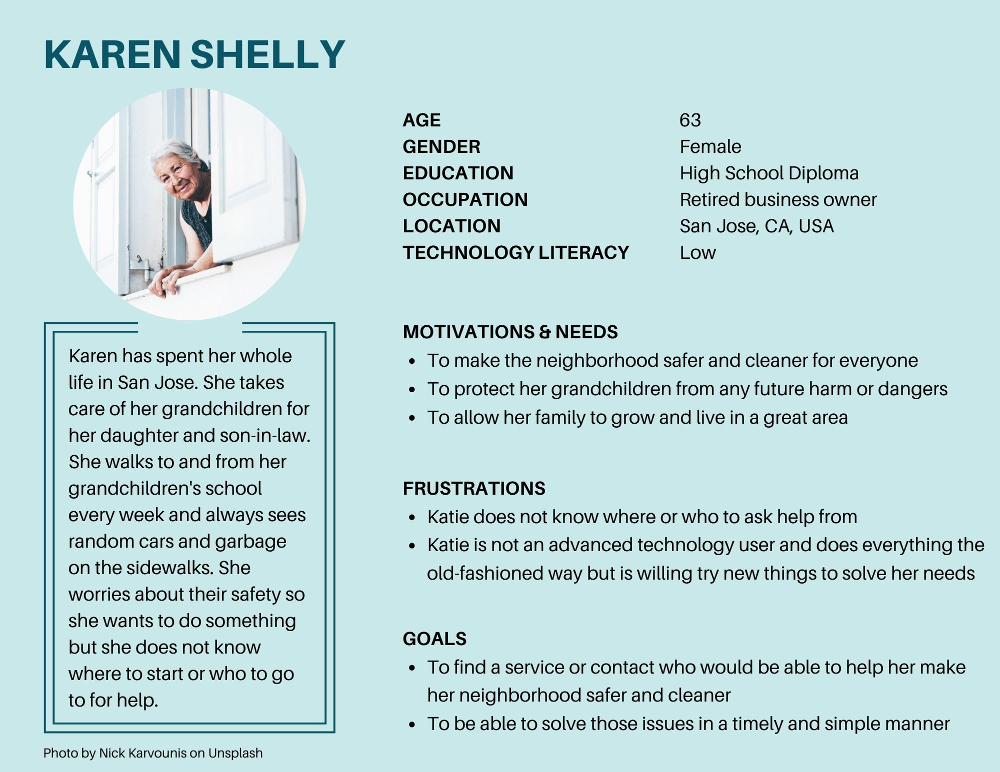 
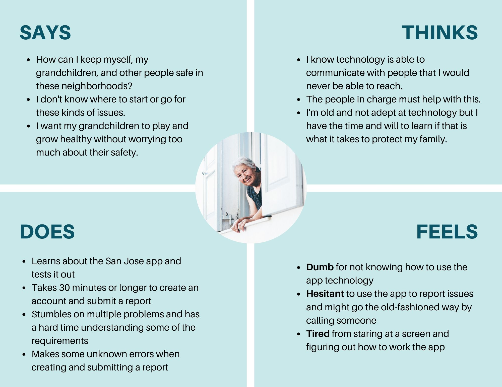
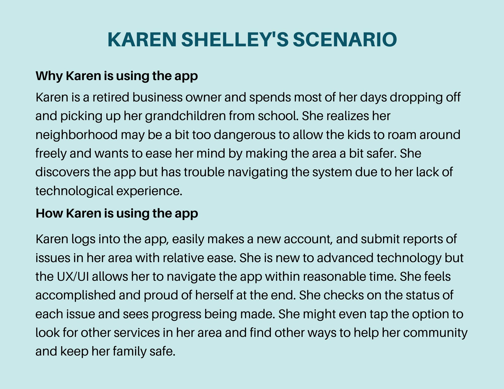 
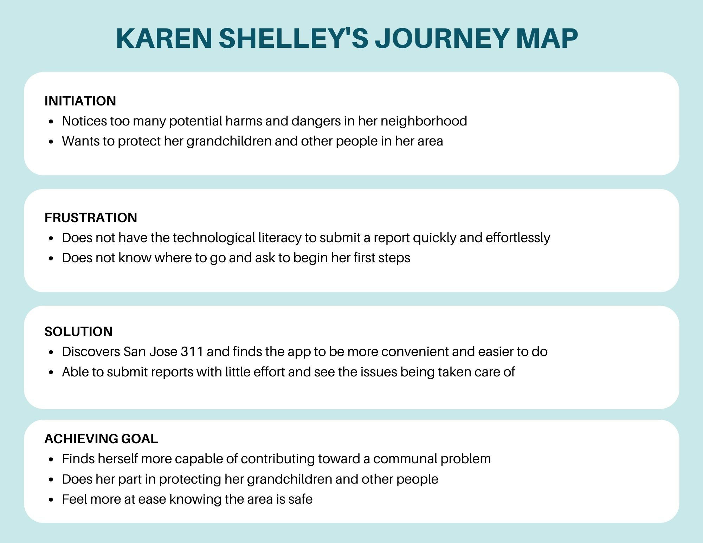 

