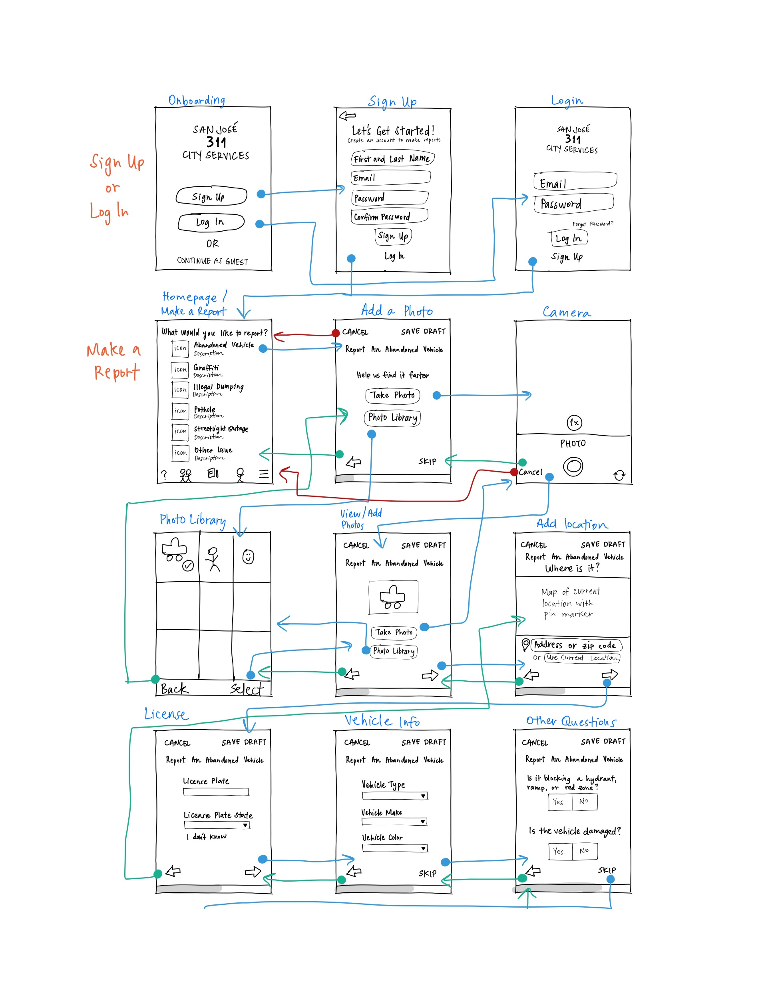
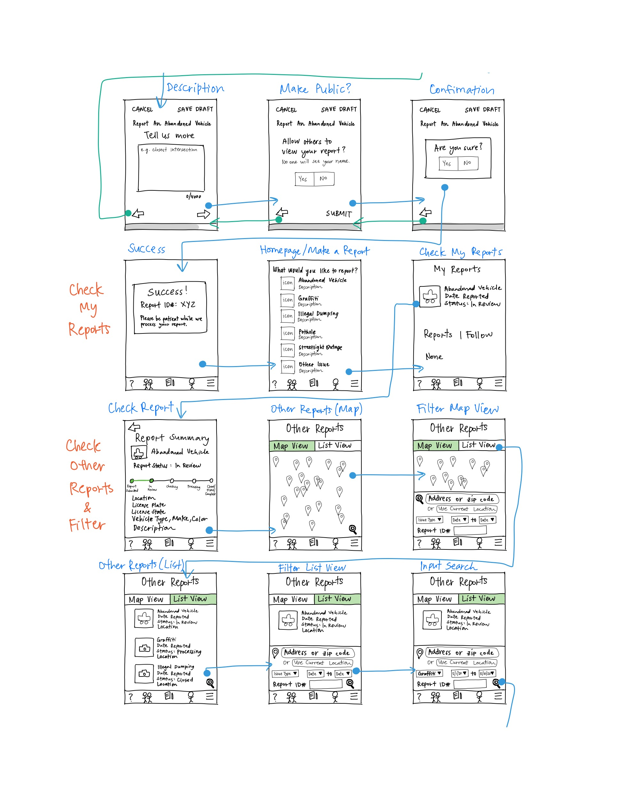
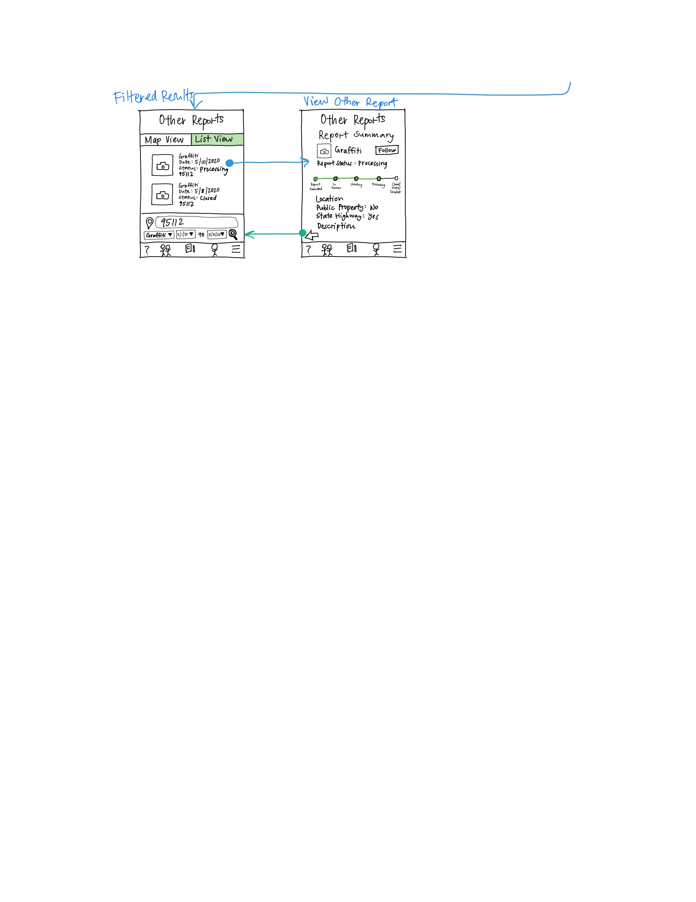

# DH150 Assignment 6: Low-Fidelity Prototype by Lillian Nguyen

## Overview

### Purpose 
Low-fidelity prototyping is a quick and low-cost way to design and test the contents of an artifact before fully investing time and money into developing the product. This allows you to get feedback from users, uncover problems early on, and make changes during the beginning stages of the design cycle. 

By making low-fidelity prototypes for my project, I can test the features of my design with users and make further improvements before working on the high-fidelity prototypes.

### User Research
Based on my contextual inquiry, I will focus on these three research questions:
* How might we improve the report system for better tracking?
* How might we bring locals together to contribute toward keeping San Jose clean and safe?
* How might we create an intuitive design so users can accomplish tasks quickly and effortlessly?

Here is more information on the [user research](https://github.com/lilliannguyen97/DH150/blob/master/Assignments/A04/README.md).

### Personas and Scenarios
I created personas and scenarios centered around features that would solve each research question.
* A man with medium technical literacy and wants to have transparent and timely updates on his reports.
* A new undergraduate with high technical literacy and wants to browse and search for other reports in her community.
* An elderly woman with low technical literacy and wants to submit reports quickly and effortlessly.

Here is more information on the [personas and scenarios](https://github.com/lilliannguyen97/DH150/blob/master/Assignments/A05/README.md).

### Wireframes and Wireflows
The three main features:
1. Make a report
1. Check my reports
1. Check other reports with filter/advanced search

### Low-Fidelity Prototype Testing

