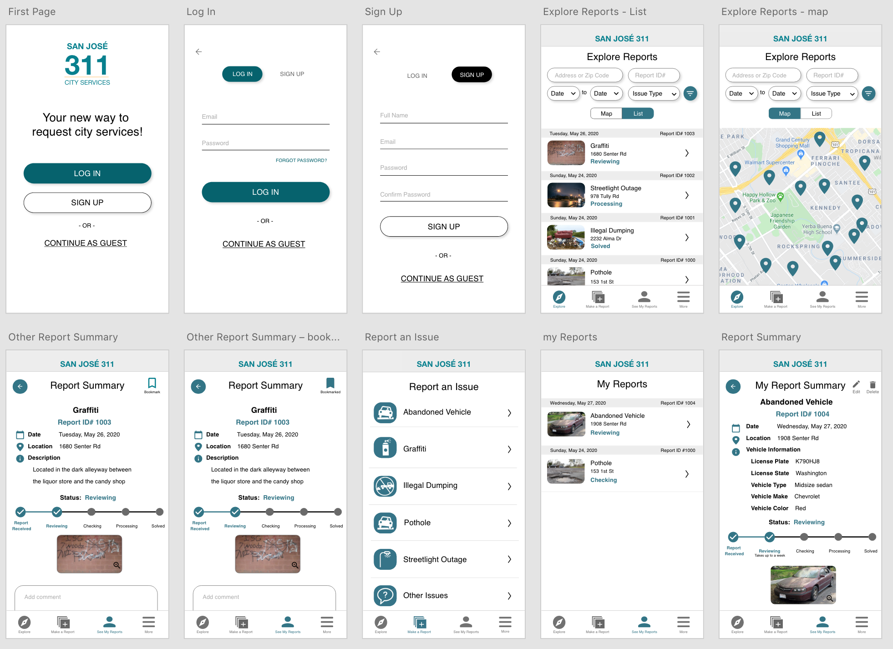
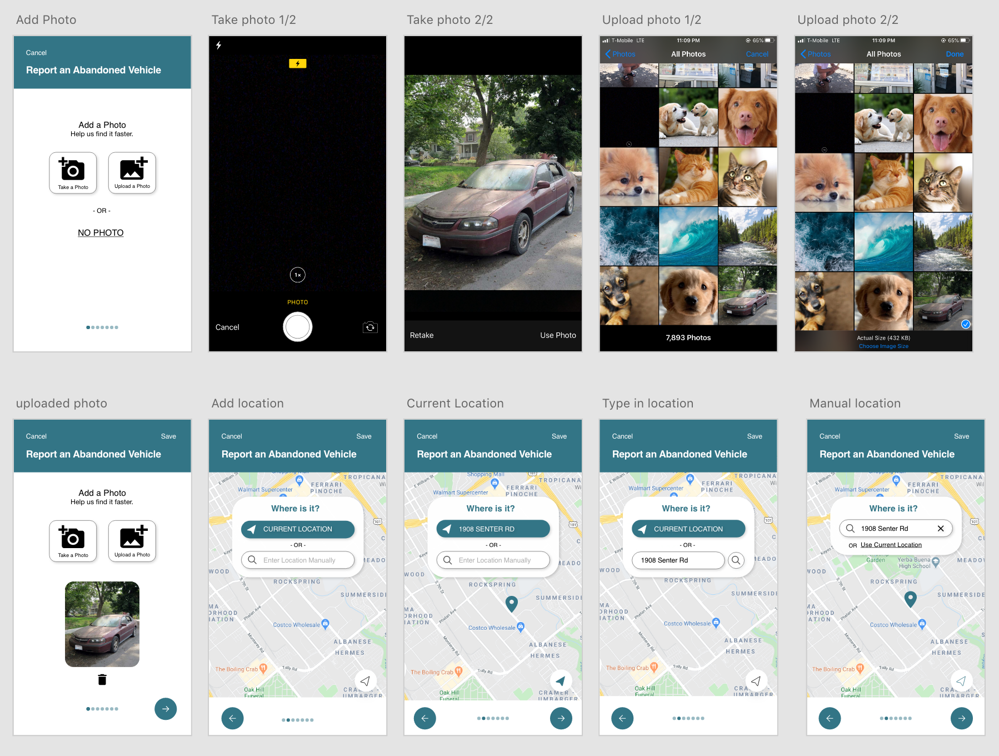
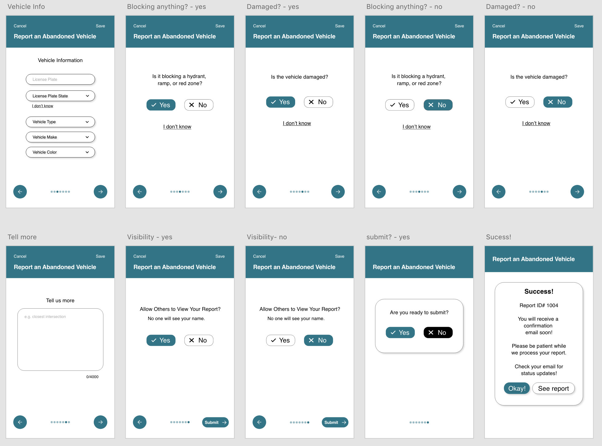
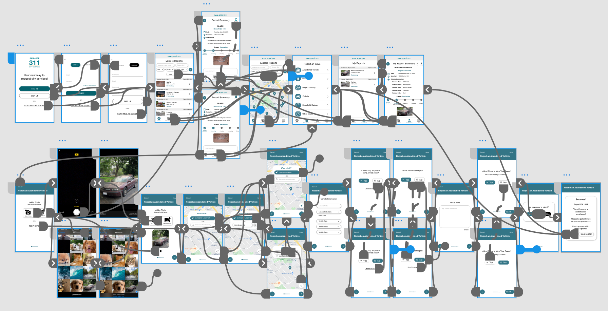
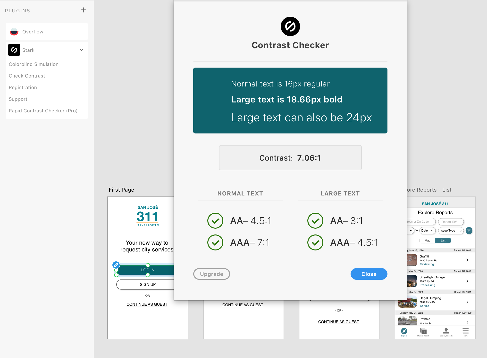

# DH150 Assignment 7: High-Fidelity Prototype by Lillian Nguyen

## Overview

**Project Description**: To improve the San Jose 311 app by solving three main tasks 
1. Make a report
   - A step-by-step application process
1. Check my reports
   - Visibility of report status 
   - Ability to edit report after submission
1. View other reports with filter/advanced search
   - Map and list view to see other reports
   - Advanced filtering to search other reports

**Purpose**: High fidelity prototyping allows people to visualize the product while it is functional and interactive so that users could test it out and designers can continue to iterate and make improvements.

**Process**: The prototype was created using **Adobe XD**. After collecting user research data and creating personas/scenarios, I drew low-fidelity prototypes based on the needs of the targeted users. From there, I continued to revise my prototype based on the in-class impression test and cognitive walkthrough. 

## "Explore" and "My Reports" Tasks

The first landing page is the **Explore** page, which is an updated feed of reports submitted by other people. I chose this to be the first thing people see in order to generate an initial sense of community and curiosity. This page has a visible filtering system for transparency and quick access. When a user taps on a report, they have an overview of the details and have the option to bookmark and comment. 

The **My Reports** page lets users view and track their report(s) after submitting them. They can see the progress of the report and the approximate time it takes at the current stage. Theere is an option to edit and delete the report too. 

## "Make a Report" Task

The second page is the **Make a Report** page. It is a simple list of six types of issues to report. Only the "Abandoned Vehicle" button works; upon clicking it, the application process starts immediately. I broke the report into sections rather than a long continuous page to make it less daunting for some users and decrease potential mistakes. A progress tracker allows them to see their process in the application so that they are more likely to complete it.

## Graphical Interface

I used the main color *teal* to follow the app logo and set the overall theme. I checked the accessibility color contrast for the *teal* color through the Adobe Stark plugin and it is WCAG 2.1 AA/AAA compliant. The other main colors are black and white to keep the theme simple and less distracting. I avoided fancy UI components to maintain the professionalism but used round icons and buttons to make the app more welcoming. 

