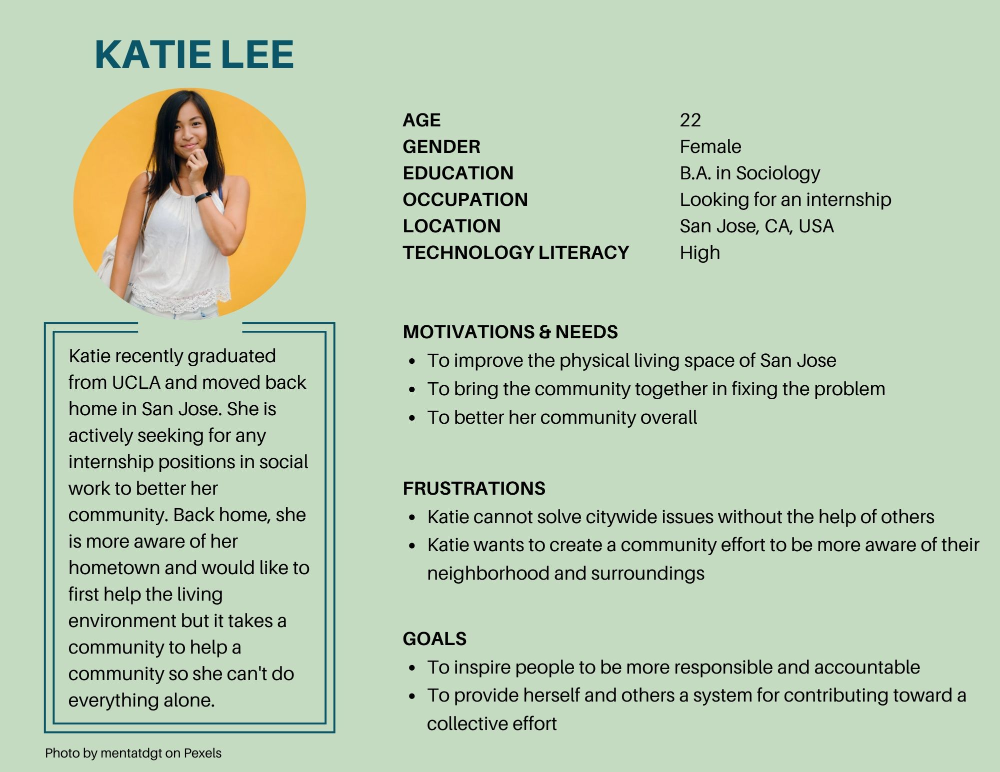
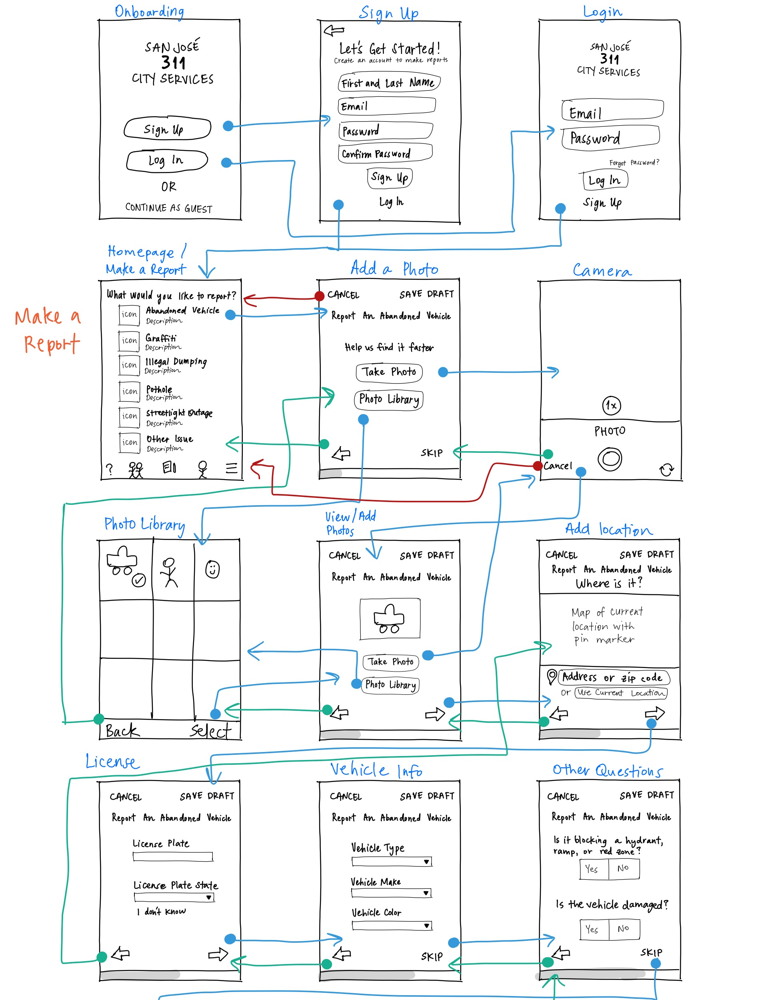
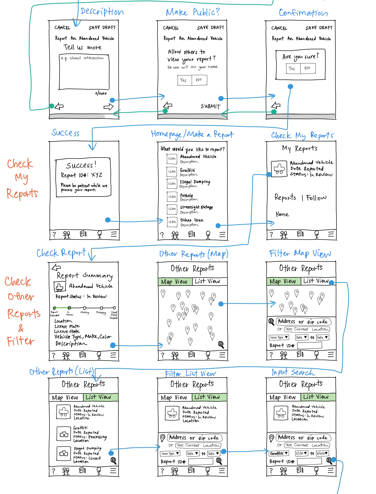
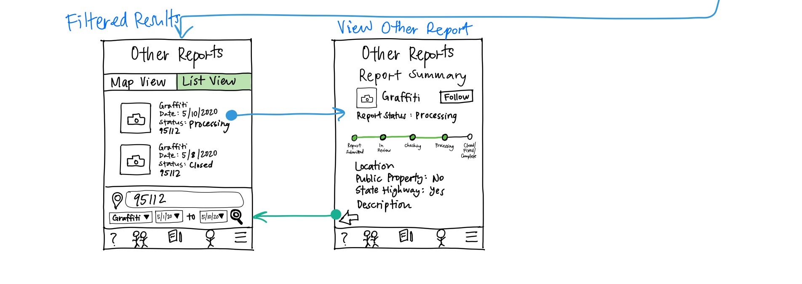
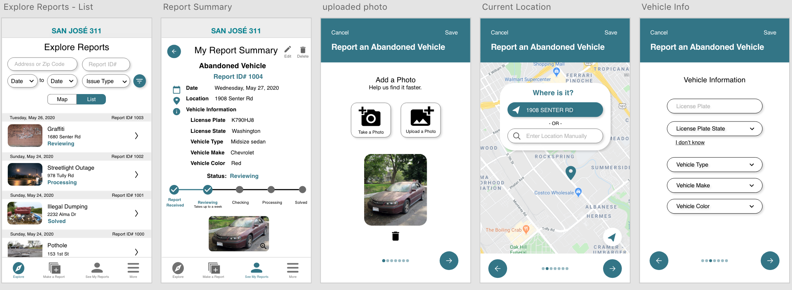

# San José 311
### by Lillian Nguyen

With the **San José 311** mobile app, help maintain the safety and cleanliness of the city of San José by connecting to City services and crew. Report non-emergency issues and track the status at each phase. Stay updated on issues in the community by viewing and following reports made by other people.

## Introduction
As a San José local for all of my life, it is important to me that my community is safe and clean for everyone. The San José app has the potential to do more than be another platform for reporting issues; it can bring locals together to contribute towards keeping their home well-maintained and connected with the City services. The app aims to evoke a sense of community and curiosity, motivating people to be more aware of their surroundings. With each individual action is a collective effort towards building a safe, clean, and connected community.

## Design Statement
**How might I create an intuitive design that all community members can use efficiently and effortlessly?**

It is important to design an app that people with different levels of technology literacy to accomplish their tasks with ease. Keeping this in mind, it is important that the app provides a good user experience for all to inform and be informed through the reports submitted to the city. Having a transparent feedback system facilitates the connection between residents and City crew. The current state of the app causes unnecessary delays and confusion to both experienced and inexperienced tech users, leaving them to take no action or the inconvenient route (report by phone or computer). 

## Competitor Analysis
The San Jose 311 app is a great resource for bringing people together to work toward a common goal. It is a convenient way to access and request city services, however improvements can be made to allow for a more seamless experience that motivates people to continue helping their community. Upon evaluating the app, I noticed issues with completing the following tasks: 
1. Creating and submitting a report
1. Checking the status of the report
1. Searching for reports made by other people

[Read more](https://github.com/lilliannguyen97/DH150/blob/master/Assignments/A01/README.md)

## User Research
Here are 3 key insights derived from my contextual inquiry:

* It is important to report an issue for not only the individual but also for the community. The app is a community tool for   
  keeping public spaces safe and clean. A motivating factor of reporting issues is the knowledge that it contributes to the 
  well-being of the mojority and not just oneself. 

* The participant would like least 30 minutes to submit a report. With more use, they will gradually learn to use the app.  
  Technical ability is important for being able to navigate the app efficiently but a good UX design that caters to those with   multiple abilities is best. 

* The participant did not encounter any problems while using the app and attributes the lack of problems to his learning 
  curve. It seems like poor UX is not one of the problems for navigating the app because the participant thinks their 
  technical ability can be improved, which, in turn, obscures the possibility of the system being a problem. 

[Read more](https://github.com/lilliannguyen97/DH150/blob/master/Assignments/A04/README.md)

## UX Storytelling
In order to create better products centered around the user, it is important to understand their motives, frustrations, and needs. I created personas and scenarios on the target audience:
* A man with medium technical literacy and wants to have transparent and timely updates on his reports.
* A new undergraduate with high technical literacy and wants to browse and search for other reports in her community.
* An elderly woman with low technical literacy and wants to submit reports quickly and effortlessly.

[Read more](https://github.com/lilliannguyen97/DH150/blob/master/Assignments/A02/README.md)

 

## Wireframe and Graphic Design Element Variation
I avoided fancy UI components to maintain the professionalism but used round icons and buttons to make the app more welcoming. The simplicity of the design makes it look credible and less distracting. Through the minimalistic and clear design, I attempted to follow these interface design principle, such as direct manipulation by making each button intuitive and picture-superiority effect by adding useful icons. I chose Roboto font since it is easy to read and looks professional.

## Low-Fidelity Prototype 
By making low-fidelity prototypes for my project, I can test the features of my design with users and make further improvements before working on the high-fidelity prototypes. Here is the break down of my choices:
1. Step-by-step process to improve flow of questions
1. A status tracker and progress update for transparency 
1. Easy filters to search for specific reports
[Read more](https://github.com/lilliannguyen97/DH150/blob/master/Assignments/A06/README.md)
  

## High-Fidelity Prototype
After testing the low-fidelity prototype and making further revisions, I used Adobe XD to create a high-fidelity prototype. The **Explore** page is for viewing and searching other reports. The **Make a Report** page allows people to create and submit reports on an issue. **My Reports** is the page to see and track progress of all submitted reports. I used a simple and professional design since it is a City app and followed the color theme of their logo.

[Read more](https://github.com/lilliannguyen97/DH150/blob/master/Assignments/A07/READme.md)

Here is the link to the [**Interactive Prototype**](https://xd.adobe.com/view/b0b44283-18eb-460b-5381-bcbe85c657d5-c685/?fullscreen).

## Pitch Video
Here is the link to the [Pitch](https://photos.app.goo.gl/dgNUAhHLe9iB2N3q7)!

## Conclusion
I learned how important user research and testing is to really gain insight into what people need. I may have my own ideas on what to design however it is humbling when I learn about how people interact with product. User-centered design is necessary for designing something that people would love and enjoy to use. Building the experience around them is rewarding. Constant redesigning is a continuious process and I have to accept that I will never make the perfect design. What's more important is how the users feel about the product.
