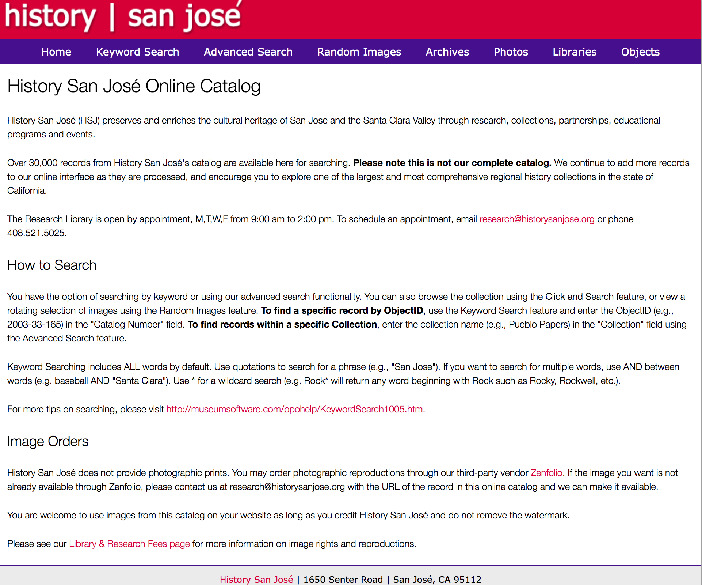
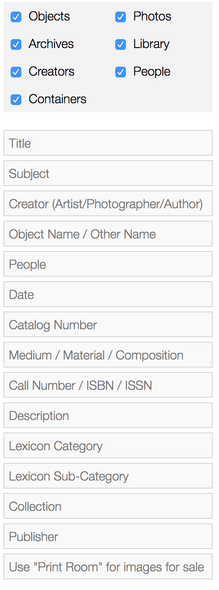
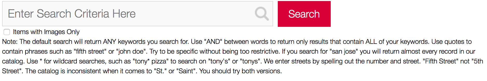
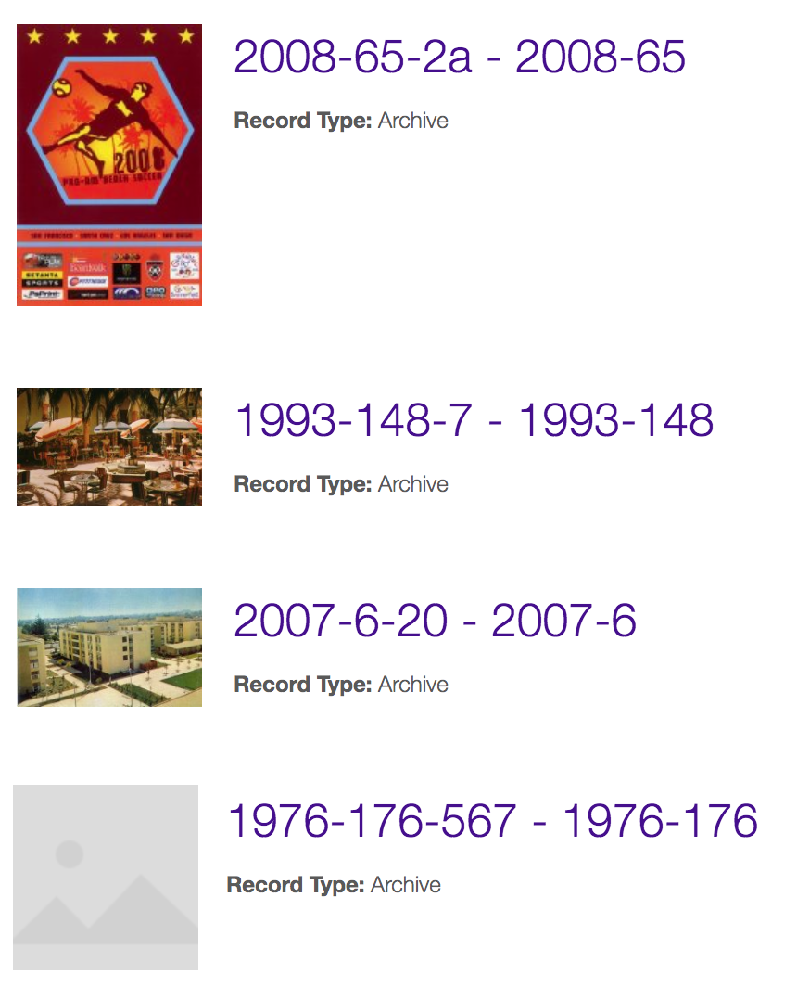
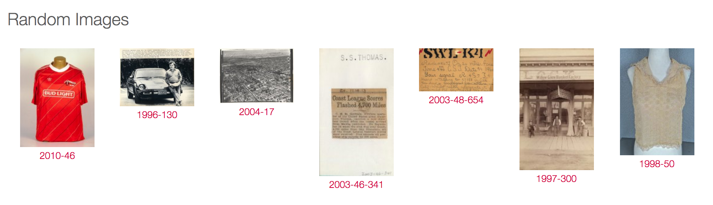

# San José Resources

## DH150 Assignment 1: Heuristic Evaluation by Lillian Nguyen
Being back in San Jose during the COVID-19 quarantine, I’ve decided to focus on my hometown for this project, specifically the unexplored resources that the city provides. I’ve lived in San Jose my entire life until I moved away to attend UCLA, where I realized the vast resources that the school provides. I wanted to explore whether my city offers anything cool and interesting for the public, so I browsed the internet and found two resources: an online archives catalog that conserves the city’s historic collections and an app to report any issues in the San Jose area. By improving the UX design, the site and app would become more user-friendly and accessible, creating a more well-informed and safe community. 

## Severity Scale for Usability Problems
The following 0 to 4 rating scale can be used to rate the severity of usability problems:
Rating  | Reason  |
:---: | :---  |
0  | I don't agree that this is a usability problem at all  |
1  | Cosmetic problem only: need not be fixed unless extra time is available on project  |
2  | Minor usability problem: fixing this should be given low priority  |
3  | Major usability problem: important to fix, so should be given high priority  |
4  | Usability catastrophe: imperative to fix this before product can be released  |

(Credit: NNgroup - https://www.nngroup.com/articles/how-to-rate-the-severity-of-usability-problems/)
 
### Heuristic Evaluation of Website - History San José Online Catalog
https://historysanjose.pastperfectonline.com/

History San José, a non-profit organization under the City of San José, aims to preserve and enrich the cultural heritage of San Jose and surrounding area through research and collections, to name a few. This growing online catalog holds over 30,000 records of photographic collections, images of material culture, archives, and libraries. The homepage has 3 main components: the navigation bar, the body with information on the catalog, search methods, and image orders, and the footer with contact information. The navigation bar has 8 items: “Home,” “Keyword Search,” “Advanced Search,” “Random Images,” “Archives,” “Photos,” “Libraries,” and “Objects.”

 

#### Initial Evaluation 
The search tools and information architecture are particularly concerning and hinder a user’s efficiency. The keyword and advanced search tools have their own pages and specific functions, making the search task more complicated. I was also very confused on what the menu items entail due to the terminology (e.g. random images versus photos, archives versus libraries) and what types of records fit within each category. There is also no organization or hierarchy of content within each of the other links when a user first lands on the page since it is just a layout of random records; they are not subcategorized either. 

#### #1: Visibility of System Status
Rating  | Evaluation  |
:---: | :---  |
0  | Each menu item block in the navigation bar changes color when the cursor is hovered over it, giving a clear feedback distinction.  |
1  | When a user is on a specific tab or page, the menu item block in the navigation block does not change color at all. Therefore, a user would not know which page they are on and/or what type of record is being shown (e.g. “Photos” or “Objects”).  |
1  | When the cursor hovers over a record photo or label, the outline of the photo frame or the font color of the label changes to the color red. However, it could be hard to distinguish for people with poor color vision because of the slight color change.  |
1  | The outline of the text search box with a magnifying glass on the right end changes from gray to blue, indicating the function is ready to be used.  |
1  | A user must click on the bright red search button next to the search button. The search button slightly changes from bright red to a darker shade of red when a cursor is hovered over it, which is barely noticeable and could be changed to make the change more obvious.  | 
1  | There is no progress indicator when searching for items so a user has no indication on whether their search is being executed or not. It would be nice to have some kind of notification of a search completion, although it is not significant.  |

#### #2: Match between system and the real world
Rating  | Evaluation  |
:---: | :---  |
2  | The terminology used to filter out searches in the “Advanced Search” page may not be easily known; some users may question the function of some of the filters, such as “lexicon category” and “lexicon sub-category.”  |
3  | The terminology used for the categories “Archives” and “Libraries” can be undistinguishable to some people who are unfamiliar with how the system works. An option may be to categorize both into “Collections” and clearly organize the archives records from the libraries records.  |
3  | Each record is labeled with their catalog and accession numbers, instead of its corresponding title and description. A user would not understand the context behind the item based on that information and would have to click on the photo to see the full description.  |

 

#### #3: User control and freedom
Rating  | Evaluation  |
:---: | :---  |
0  | A reset button in the “Advanced Search” page allows a user to undo all of their typed searches and start all over.  |
1  | There is an option to “Return to Search Results” with no change to the search boxes/filters. However, the words are very small and can easily be overlooked. The red font does not help to make it stand out.  

#### #4: Consistency and standards

 

Rating  | Evaluation  |
:---: | :---  |
1  | The magnifying glass icon in the search bar is not clickable, which this icon usually is in other cases. A user can be confused and assume the icon is a button for initiating a search.  |
2  | The advanced search page does not have an option to show only records with images. The keyword search page does have one.
3  | The menu item “Random Images” may be confusing. At first, I wondered whether it meant a curated or computer-generated random selection of record items or a space for record items that do not go under the other pages. It has no search bar either. The purpose of the page is to showcase a “rotating selection of images using the Random Images feature.”  |
3  | The search options are not consistent with usual types of search engines. The keyword search and advanced search are mutually exclusive and are their own search engines by themselves. There is no option to filter out a keyword based on the filters from the advanced search. The types of filters in the advanced search are almost unusable to the general public, only the creators, since most people would probably not know the title, catalog number, lexicon category, etc.  |
3  | Much of the information architecture seems to be organized through the lens of the creators and how they themselves would structure information. For example, the advanced search works better for the familiarized research worker rather than a typical user who wants to find an item based on a keyword and filtered by date. The menu items in the navigation bar also have no hierarchy or sub-hierarchies.  |
3  | The large “History San Jose” heading does not link to the homepage of the online catalog; it is linked to the main website of History San Jose. The “Home” is the first menu item in the navigation bar but is easily overlooked by all the other tabs.  |

#### #5: Error prevention
Rating  | Evaluation  |
:---: | :---  |
1  | A typo indicator would be useful, even though I understand searches can be anything at all or a name spelling could be unique.  |
2  | The search engines could offer a suggestions dropdown. I understand that searches can be anything at all, but if a system can detect words/phrases being typed, then it could be very useful in preventing misspellings.  |
2  | The advanced search filters do not offer a note for some of the formats. For example, the catalog number requires the hyphens, and the date is formatted as year/month/day or ####/##/####.  |

#### #6: Recognition rather than recall
Rating  | Evaluation  |
:---: | :---  |
2  | The search engines could offer suggestions in a search engine dropdown to transition a user from recalling to recognizing a word or phrase.  |
2  | The results page can offer a list of related words/phrases or similar suggestions to the typed searches, thereby helping a user recognize/inspire a new search. For example, if a user searches for “bike,” the results page can suggest “bicycle.”  |
3  | Overall design and terminology of the website makes it hard for a user to recall the workings of the system. For example, a user having to remember how to use the advanced search or which filters were used because there is no color change.  |
3  | The website can include a bar or list of records that a user clicked on or change the record color to indicate that it has already been viewed. The results page only shows a photo (if any), numerical label and/or collection, and record type. Most, if not all, are not unique enough or easy to remember when browsing.  |

 

#### #7: Flexibility and Efficiency of Use
Rating  | Evaluation  |
:---: | :---  |
3  | The keyword search page includes a long paragraph on how to use Boolean search in a complicated and overwhelming way. The search engine can be designed in a way that allows a user to do Boolean search without typing out the specific Boolean operators.  |
3  | The advanced search filters can be redesigned and reorganized into a better search system that both experts and novices can use. The current engine is more navigable to experts and slows down a typical user.  |
3  | A user has to click on the record photo, not the corresponding label, in the results page to view the entire record information. There is no quick view to see a closer look at the image either.   |

#### #8: Aesthetic and minimalist design
Rating  | Evaluation  |
:---: | :---  |
2  | There are too many menu items (total of 8) in the navigation bar. The search engines can be combined to one tab. “Random Images” can be deleted if it serves no purpose.  |
3  | There is no sense of hierarchy. A user should be able to search for an item immediately once arriving at the homepage, rather than decide whether to do a keyword or advanced search. The search engine can be added to the visible portion of the homepage without scrolling.
3  | The extra information on the homepage can go into an “About” or “Help” page. All the information is overwhelming and can be better organized for quick reading.  |
3  | Overall aesthetic looks historic and not engaging. The use of colors is misleading - the abundance of red font and colors when there is no need to draw attention in an alarming way.  |
3  | The layout of the photos on the “Random Images” page is messy due to the various sized photos, causing misalignment of the labels.  |

 

#### #9: Helps users recognize, diagnose, and recover from errors
Rating  | Evaluation  |
:---: | :---  |
3  | In the “Image Orders” portion of the homepage, the link to the Library and Research Fees page cannot be found.  |
3  |  There are no notifications for the advanced search filters. A user would not know whether their search or the formatting is incorrect.  |

#### #10: Help and documentation
Rating  | Evaluation  |
:---: | :---  |
3  | The “How to Search” portion of the homepage is the only source of help in the website. It gives some information on some advanced searches and Boolean functions. There is no description or example for all of the filters.  |
3  | The keyword search page includes a note on how to do Boolean searches. It may be good to refresh people on how to use the search but a novice may be confused because of the way it is explained.  |

### Heuristic Evaluation of App - San José 311

